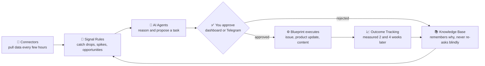

<div align="center">
  <h1>Blueprint</h1>
  <p><strong>A personal business operating system, run by AI agents you actually trust.</strong></p>
  <p>Blueprint watches your tools, finds what's worth acting on, proposes the fix, and executes it the moment you say yes — with a paper trail, a rollback, and a measured outcome on everything it does.</p>

  <p>
    
    
    
    
    
    
    
  </p>

  <p>
    <a href="#-quick-start"><strong>Quick Start</strong></a> ·
    <a href="#-what-is-blueprint">What is it?</a> ·
    <a href="#-why-blueprint">Why Blueprint?</a> ·
    <a href="#-the-feature-tour">Features</a> ·
    <a href="#-installation">Install</a> ·
    <a href="#-external-agents-bap">API / BAP</a>
  </p>
</div>

---

## 📖 Table of Contents

- [What is Blueprint?](#-what-is-blueprint)
  - [The loop](#the-loop)
  - [What makes it different](#what-makes-it-different)
- [Why Blueprint?](#-why-blueprint)
  - [Who it's for](#who-its-for)
  - [Blueprint vs. the alternatives](#blueprint-vs-the-alternatives)
- [Quick Start](#-quick-start)
- [The Feature Tour](#-the-feature-tour)
  - [Connectors — 22 integrations, zero glue code](#-connectors)
  - [Agents — 12 specialists with editable personalities](#-agents)
  - [Intelligence Layer — reasoning, not just reporting](#-intelligence-layer)
  - [Command & Governance Layer](#-command--governance-layer)
    - [Decision Queue & Comparison Mode](#decision-queue--comparison-mode)
    - [Executive Command Centre](#executive-command-centre)
    - [Multi-Business Portfolio View](#multi-business-portfolio-view)
    - [The "While You Were Away" Digest](#the-while-you-were-away-digest)
    - [Explanation Panels — "why did Blueprint do this?"](#explanation-panels--why-did-blueprint-do-this)
    - [Natural-Language Audit Search](#natural-language-audit-search)
    - [Automated Retrospectives](#automated-retrospectives)
    - [Safe Simulation / Preview Mode](#safe-simulation--preview-mode)
    - [Reusable Bounded Playbooks](#reusable-bounded-playbooks)
    - [Operating Policy & Action Receipts](#operating-policy--action-receipts)
  - [Knowledge Base — a wiki that writes itself](#-knowledge-base)
  - [Write-Back Actions — real changes, always reversible](#-write-back-actions)
  - [External Agents (BAP)](#-external-agents-bap)
- [Architecture](#-architecture)
- [Installation](#-installation)
  - [Windows](#windows)
  - [macOS](#macos)
  - [Linux](#linux-ubuntu-debian-fedora-arch-raspberry-pi-os)
  - [Docker (any OS)](#docker-any-os)
- [After Installation](#-after-installation)
- [Common Commands](#-common-commands)
- [Troubleshooting](#-troubleshooting)
- [Requirements](#-requirements)
- [Environment Variables](#-environment-variables)
- [Security & Data Handling](#-security--data-handling)
- [Contributing](#-contributing)
- [License](#-license)

---

## 🧭 What is Blueprint?

Most "AI for your business" tools are chatbots wearing a business suit — you ask a question, you get an answer, and nothing actually happens. Blueprint is the opposite: it's an **operating system**. It sits between your business tools and your team, permanently watching, permanently reasoning, and — once you say yes — permanently *doing*.

Connect your analytics, your store, your ad accounts, your CMS. Blueprint's agents read the data the way a sharp operator would: not "traffic is down 3%" but "traffic is down 3% *and* it started the same day GSC stopped indexing your blog, *and* here's the fix, *and* here's what it'll cost to be wrong." You approve or reject. Nothing executes without you — until you decide it can.

### The loop



1. **Connectors** pull data from your tools every few hours.
2. **Signal rules** detect anomalies, drops, and opportunities.
3. **AI agents** analyse the data and propose a specific, scoped task — not a vague suggestion.
4. **You approve** the task, from the dashboard or straight from Telegram.
5. **Blueprint executes** — opens a GitHub issue, updates a Shopify listing, drafts a page, whatever the task calls for.
6. **Outcome tracking** checks, 2 and 4 weeks later, whether the change actually worked — and feeds that verdict back into future decisions.
7. A **compounding knowledge base** grows smarter with every cycle, so agent #500's proposal is sharper than agent #1's.

Every step is logged. Every action has a paper trail. Every write-back can be undone.

### What makes it different

- **It executes, not just reports.** Approved tasks create real GitHub issues, real Shopify updates, real content — with rollback data captured before anything changes.
- **It measures its own work.** Outcomes are checked automatically weeks later, not assumed at approval time. A task that didn't work is recorded as such and shapes what the agents propose next.
- **It explains itself.** Click "why did Blueprint do this?" on anything — a task, a decision, a hiring proposal — and get the actual trigger, the actual evidence (rated fresh/stale/missing, never invented), and every alternative that was considered and rejected.
- **It never grants itself more trust than you gave it.** A typed Operating Policy governs what any agent — human-directed or fully autonomous — can do without a human in the loop, enforced at the moment of execution, not just at proposal time.
- **It's yours.** Self-hosted, your data never leaves your machine unless you point it at a cloud LLM, and even then only the prompt goes out — the wiki, the database, and every credential stay local.

---

## 💡 Why Blueprint?

### Who it's for

- **Solo operators and small teams** running an e-commerce store, a content site, a SaaS, or an agency who want the analytical rigor of a data team without hiring one.
- **Agencies** managing several client businesses who need one dashboard, one policy layer, and one portfolio view across all of them (see [Multi-Business Portfolio View](#multi-business-portfolio-view)).
- **Builders wiring up their own AI agent** — Claude Code, a custom LLM loop, or anything that speaks HTTP — who want a real operating substrate to act through instead of scraping a dashboard (see [External Agents (BAP)](#-external-agents-bap)).
- **Anyone burned by a black-box automation tool** that changed something and couldn't say why, or couldn't be undone.

### Blueprint vs. the alternatives

| | Hiring an agency | A SaaS "AI insights" tool | Rolling your own scripts | **Blueprint** |
|---|---|---|---|---|
| Acts on your data, not just reports on it | Sometimes, on a monthly cadence | Rarely — mostly dashboards | Yes, if you build it | **Yes — proposes and executes, on approval** |
| Explains *why* it did something | Depends on the person | Almost never | You have to build it | **Every action has an evidence-cited explanation** |
| Measures whether the change actually worked | Rarely, informally | No | You have to build it | **Automatic outcome tracking, 2 & 4 weeks out** |
| Runs on data you own, on hardware you control | No | No | Yes | **Yes — self-hosted, local-first** |
| Cost | £2,000–£10,000+/mo | £50–£500+/mo per tool | Your engineering time | **Free and open source; LLM cost only, and $0 with local Ollama** |
| Rollback on every change | Depends | N/A | You have to build it | **Every write-back captures rollback data automatically** |

---

## ⚡ Quick Start

The fastest path on any OS is Docker:

```bash
git clone https://github.com/chrisgwynne/Blueprint-2.0
cd Blueprint-2.0
docker compose up -d
```

Open **http://localhost:4000** — the onboarding wizard walks you through choosing an LLM provider and connecting your first data source. No API key required if you use [Ollama](https://ollama.ai) (free, fully local).

For native development instead of Docker, jump to [Installation](#-installation).

---

## 🗂️ The Feature Tour

### 🔌 Connectors

**22 integrations**, each battle-tested with real API pagination, rate-limit handling, and honest freshness reporting — a connector never claims fresh data from a partial or failed sync.

| Category | Connectors |
|---|---|
| **Search & SEO** | Google Analytics 4 · Google Search Console · PageSpeed Insights · Google Business Profile · Google Ads · SEMrush |
| **Commerce** | Shopify · Stripe · Google Merchant Center |
| **Email & CRM** | Brevo · Klaviyo |
| **Social** | Facebook & Instagram (organic) · Meta Ads · Buffer |
| **Productivity & Infra** | Todoist · UptimeRobot |
| **Code** | GitHub |
| **CMS** | WordPress · Kirby · Wix |
| **Direct mail & marketing** | Stannp |
| **Server access** | SSH / FTP, for direct read + approved write-back |

Connector-specific setup guides:
- [Meta Social Publishing](docs/META-SOCIAL-PUBLISHING.md) — Facebook Page + Instagram publishing setup

Building your own connector takes about 2 hours — see [CONTRIBUTING.md](CONTRIBUTING.md).

### 🤖 Agents

**12 specialist agents**, each with an identity, values, and operating principles defined in editable markdown "soul files" — not a black-box prompt buried in code.

| Agent | Role |
|---|---|
| **Conductor** | Strategy & orchestration — the central brain |
| **SEO Sentinel** | Search rankings, keywords, Core Web Vitals |
| **Quill** | Copywriting and content strategy |
| **Trend Spotter** | Growth opportunities and market patterns |
| **Reporter** | Weekly briefings and monthly reports |
| **Merchant** | Shopify and ecommerce operations |
| **Velocity** | Site performance and speed |
| **Ledger** | Revenue intelligence |
| **Sentinel** | Infrastructure monitoring |
| **Researcher** | Competitive intelligence |
| **Dev** | GitHub PRs and issues |
| **Outreach** | Campaign intelligence |

Agents run on **any LLM** — Claude, GPT-4, Gemini, or fully local models via Ollama — and only the ones your connected data actually supports come online; the rest stay dormant until you hire them.

### 🧠 Intelligence Layer

On top of the data pipeline, Blueprint reasons strategically instead of just pattern-matching:

- **Goal Reasoning** — every goal gets a real strategic plan: feasibility, decomposed paths, milestones, and briefings handed to the agents working toward it.
- **Scenario Planning** — ask "what if?" and get 3–4 modelled scenarios side-by-side, not a single guess.
- **Conflict Detection** — goals, tasks, and actions that contradict each other are flagged before they corrupt attribution.
- **Signal Attribution** — every signal gets probability-weighted causes and an ACT/WAIT/MONITOR recommendation, not a raw alert.
- **Agent Calibration** — each agent's stated confidence vs. its actual track record is tracked; overconfident agents are automatically demoted to a stricter approval tier.
- **Proactive Goal Suggestions** — Blueprint scans connector data for quantified opportunities and suggests goals with real £/month estimates attached.
- **Constraint-Aware Scheduling** — agent runs are delayed when data is stale or a measurement window is still open, instead of double-counting the same change.
- **"Why is this happening?"** — one-click deep investigation with a plain-English explanation, not a link dump.

### 🎛️ Command & Governance Layer

The layer that makes autonomous operation something you'd actually trust — every feature here is about **seeing what's about to happen, understanding what already did, and staying in control at scale**.

#### Decision Queue & Comparison Mode
Every item still waiting on a human shows up in one queue with the *reason* it's waiting — `manual_review`, `policy_gated`, or `routine` — and the risk evidence behind that lane. When you have several candidates for the same call, Comparison Mode lays them out side-by-side: what genuinely differs, what's identical, and what Blueprint simply doesn't know yet (never defaulted, never guessed).

#### Executive Command Centre
One screen for everything across every business you run: pending decisions, verified changes, ROI, connector health, and a ranked "look at this first" list — with a hard timestamp on every number so a stale figure is never mistaken for a fresh one.

#### Multi-Business Portfolio View
Running more than one business or client account? Save named groupings — "UK shops," "Q3 turnaround" — and compare them metric-by-metric, with every cell honestly marked `known`, `unknown`, or `not comparable` rather than forced into a misleading ranking.

#### The "While You Were Away" Digest
Come back after a weekend and get exactly what changed, what's pending, and what broke — deduplicated, with repeats that got *worse* promoted and flagged instead of silently buried in a collapsed count.

#### Explanation Panels — "why did Blueprint do this?"
The single most-requested feature in any AI system, built in from day one: click it on any task, decision, or hiring proposal and get the real trigger, the real evidence (with a `fresh`/`stale`/`missing` quality rating on every item — nothing invented), the policy that applied, and the alternatives that were rejected, suppressed, or deferred and why.

#### Natural-Language Audit Search
Ask a plain-English question — *"what changed on the Shopify store last week"* — instead of knowing which page or table to check. Every answer is built from records actually retrieved and cited by table and ID; a narrative summary is only shown if every claim in it resolves to a real cited record.

#### Automated Retrospectives
Monthly self-assessment that doesn't just write a report — it can raise a typed, reviewable proposal to change how Blueprint operates (tighten a policy, gate a playbook step, retire an underperforming agent), backed by measured evidence, never a hunch, and never self-activating without your review.

#### Safe Simulation / Preview Mode
Preview exactly what approving a task *would* do — the changes, the connectors touched, the policy checks it would clear — with **zero real writes**, enforced at the database layer itself, not just by convention.

#### Reusable Bounded Playbooks
Turn a proven multi-step sequence into a versioned, typed playbook you can run again. Every step still clears the same approval gate a one-off task would — reuse never means bypassing review.

#### Operating Policy & Action Receipts
A per-business, versioned Operating Policy governs exactly what any agent may do without a human — with scheduled activation and one-click rollback to any prior version. Every approved action gets a durable, 5-state Action Receipt (`requested` → `authorized` → `executed` → `externally_acknowledged` → `verified`) as proof of what actually landed, not just what was attempted.

### 📚 Knowledge Base

A compounding knowledge base following the [Karpathy LLM wiki pattern](https://karpathy.ai) — a persistent, file-based, git-backed wiki that gets smarter with every agent run, every signal, and every insight, instead of starting from zero each time.

- **Three layers**: raw sources (immutable) → wiki pages (LLM-maintained) → schema (co-evolved)
- **Wikilinks**: `[[cross-references]]` with backlink tracking
- **Contradiction detection**: flags conflicts instead of silently overwriting a prior insight
- **Obsidian-compatible**: point Blueprint at an existing vault and keep using your own editor

### ✅ Write-Back Actions

Approved tasks don't just create reports — they execute real changes:

- **GitHub** — create issues, open draft PRs
- **Shopify** — create products (draft), update descriptions, manage tags, edit collections
- **Content platforms** — publish or draft posts on WordPress, Kirby, Wix
- **Knowledge Base** — write research pages, file query results

Every write-back captures rollback data before it touches anything. Every action can be undone.

### 🔗 External Agents (BAP)

Blueprint isn't only operated from its own dashboard — the **Blueprint Agent Protocol (BAP)** exposes the same intelligence to any external AI agent over plain HTTP, permission-scoped and business-scoped down to the individual endpoint.

If you're connecting an AI agent (Claude Code, a custom LLM loop, or your own always-on assistant), install the skill file:

```bash
# macOS/Linux
cp SKILL.md /path/to/your/agent/skills/blueprint.md
```

```powershell
# Windows
Copy-Item SKILL.md C:\path\to\your\agent\skills\blueprint.md
```

Or reference it directly:
```
https://raw.githubusercontent.com/chrisgwynne/Blueprint-2.0/master/SKILL.md
```

Registration requires a logged-in dashboard session or an operator-issued `BAP_REGISTRATION_SECRET` — self-service, unauthenticated registration is never permitted, and wildcard permissions/business access are never granted automatically:

```bash
curl -X POST http://localhost:4000/api/bap/v1/register \
  -H "Content-Type: application/json" \
  -H "X-Registration-Secret: $BAP_REGISTRATION_SECRET" \
  -d '{"name":"MyAgent","requested_permissions":["signals:read","tasks:propose","kb:read"],"business_access":["biz_xxxxxxxx"]}'
```

Every feature in the [Command & Governance Layer](#-command--governance-layer) above — Decision Queue, Comparison Mode, Command Centre, Portfolios, Digest, Explanations, Audit Search, Retrospective Proposals, Simulation, and Playbooks — has a matching read (and where it's genuinely safe, write) surface over BAP. See [SKILL.md](SKILL.md) for the narrative tool guide, or [server/bap/AGENT-GUIDE.md](server/bap/AGENT-GUIDE.md) for the complete, code-verified technical reference — permissions, rate limits, and client examples for every endpoint.

---

## 🏗️ Architecture

| Layer | Tech |
|---|---|
| Backend | TypeScript + Bun + Express + SQLite (`bun:sqlite`, WAL mode) |
| Frontend | TypeScript + React 18 + Vite 5 |
| LLM | Any provider — Ollama (free/local), Anthropic, OpenAI, Gemini, LM Studio, or any OpenAI-compatible endpoint |
| Knowledge Base | File-based markdown, isomorphic-git, Obsidian-compatible |
| Deploy | Docker Compose, single container, or native Bun on any OS |

---

## 💿 Installation

Blueprint runs on **Windows, macOS, and Linux**. The setup script (`bun scripts/setup.js`) is cross-platform — it handles `.env` bootstrap, key generation, dependency installs, DB initialisation, and the frontend build with no shell dependency.

### Prerequisites (all platforms)

| Tool | Minimum | How to check |
|------|---------|--------------|
| **Git** | any | `git --version` |
| **Bun** | 1.1+ | `bun --version` |
| **Node.js** *(optional fallback)* | 20.0+ | `node --version` |

Bun is required. Node is only used if you want to run the raw `scripts/setup.js` without Bun — everything else uses Bun.

---

### Windows

#### Option A — PowerShell (recommended)

Open **PowerShell** (not Command Prompt) and run:

```powershell
# 1. Install Bun
powershell -c "irm bun.sh/install.ps1 | iex"

# 2. Close PowerShell, open a fresh window so $PATH picks up bun

# 3. Clone and set up
git clone https://github.com/chrisgwynne/Blueprint-2.0
cd Blueprint-2.0
.\scripts\setup.ps1

# 4. Run
bun run dev
```

Then open **http://localhost:4000**.

#### Option B — WSL 2 (if you prefer a Linux environment)

If you already use WSL 2, follow the Linux instructions below inside your WSL shell. Everything works identically — Blueprint stores its database and KB inside your WSL filesystem.

#### Windows notes

- **Git Bash works too** — you can run `bash scripts/setup.sh` from Git Bash if you prefer POSIX tooling. The `.sh` script is kept for Linux/macOS parity.
- **Native modules**: Blueprint uses Bun's built-in SQLite — no C++ build tools needed on Windows.
- **Antivirus**: Windows Defender occasionally slows `bun install`. Add the project folder to exclusions if install takes over 2 minutes.
- **Line endings**: the repo has a `.gitattributes` enforcing LF. If you see "CRLF will be replaced" warnings during clone, that's expected.
- **Long paths**: enable Windows long path support if `bun install` errors with `ENAMETOOLONG`:
  ```powershell
  # Run as Administrator
  New-ItemProperty -Path "HKLM:\SYSTEM\CurrentControlSet\Control\FileSystem" -Name "LongPathsEnabled" -Value 1 -PropertyType DWORD -Force
  ```

---

### macOS

Open **Terminal** and run:

```bash
# 1. Install Bun
curl -fsSL https://bun.sh/install | bash

# 2. Reload your shell (or close and reopen Terminal)
source ~/.zshrc   # or ~/.bash_profile

# 3. Clone and set up
git clone https://github.com/chrisgwynne/Blueprint-2.0
cd Blueprint-2.0
bun run setup

# 4. Run
bun run dev
```

Then open **http://localhost:4000**.

#### macOS notes

- **Apple Silicon (M1/M2/M3)**: fully supported. Bun ships native arm64 binaries.
- **Homebrew alternative**: `brew install oven-sh/bun/bun`.
- **Command Line Tools**: if `git` is missing, macOS will prompt to install Xcode CLI — accept.

---

### Linux (Ubuntu, Debian, Fedora, Arch, Raspberry Pi OS)

```bash
# 1. Install Bun
curl -fsSL https://bun.sh/install | bash

# 2. Reload your shell
source ~/.bashrc   # or ~/.zshrc

# 3. Clone and set up
git clone https://github.com/chrisgwynne/Blueprint-2.0
cd Blueprint-2.0
bun run setup

# 4. Run
bun run dev
```

Then open **http://localhost:4000**.

#### Linux notes

- **Raspberry Pi**: works on Pi 4 / Pi 5 (64-bit OS required for Bun). Use Ollama locally for zero-cost AI.
- **Headless server / VPS**: Blueprint listens on `0.0.0.0:4000` by default. Point a reverse proxy (Caddy, Nginx, Traefik) at it.
- **systemd service**: see [CONTRIBUTING.md](CONTRIBUTING.md) for a sample unit file.

---

### Docker (any OS)

```bash
git clone https://github.com/chrisgwynne/Blueprint-2.0
cd Blueprint-2.0
docker compose up -d
```

The container runs Linux internally, so it behaves identically on Windows, macOS, and Linux hosts. Data is persisted via a bind-mount to `./data`.

---

## 🎬 After Installation

### 1. Configure your LLM provider

Edit `.env`:

```bash
# Free, fully local — no API key needed
LLM_DEFAULT_PROVIDER=ollama

# Or paid cloud
# LLM_DEFAULT_PROVIDER=anthropic
# ANTHROPIC_API_KEY=sk-ant-...
```

See `.env.example` for all supported providers (Anthropic, OpenAI, Google, Ollama, LM Studio, Custom).

### 2. Install Ollama (if using local)

- **Windows**: https://ollama.ai/download/windows
- **macOS**: `brew install ollama` or download the native app
- **Linux**: `curl -fsSL https://ollama.ai/install.sh | sh`

Then pull a model:

```bash
ollama pull llama3
```

### 3. Start Blueprint

```bash
bun run dev       # development (hot reload, Vite dev server)
bun run start     # production (requires `bun run build` first)
```

Open **http://localhost:4000** → the onboarding wizard handles the rest.

---

## 🛠️ Common Commands

| Command | What it does | Cross-platform |
|---------|--------------|----------------|
| `bun run setup` | First-time install: deps, DB, client build | ✅ |
| `bun run dev` | Start server + Vite dev server with hot reload | ✅ |
| `bun run build` | Build frontend for production | ✅ |
| `bun run start` | Start production server | ✅ |
| `bun run db:init` | Re-initialise the SQLite database | ✅ |
| `bun run test` | Run the full test suite (server + client) | ✅ |
| `bun run typecheck` | Typecheck server + client | ✅ |

---

## 🩺 Troubleshooting

### "bun: command not found" after install
Close and reopen your terminal. Bun adds itself to `$PATH` but the current shell won't pick it up until restart. On Windows, the installer modifies `%USERPROFILE%\.bun\bin` — open a fresh PowerShell window.

### Port 4000 already in use
Change `PORT` in `.env`, or find and stop the conflicting process:
- **Windows**: `netstat -ano | findstr :4000` then `taskkill /PID <pid> /F`
- **macOS/Linux**: `lsof -i :4000` then `kill -9 <pid>`

### Database is locked
Another Blueprint instance is running, or a previous process crashed without releasing the WAL. Close all Blueprint windows, then:
- **Windows**: delete `data\blueprint.db-shm` and `data\blueprint.db-wal`
- **macOS/Linux**: `rm data/blueprint.db-shm data/blueprint.db-wal`

### Git hooks fail on Windows
If you see `error: cannot spawn .husky/pre-commit: No such file or directory`, the hook file needs Unix line endings. Run:
```bash
git config core.autocrlf input
```
Then re-clone.

### Permission denied on scripts/setup.sh (macOS/Linux)
```bash
chmod +x scripts/setup.sh
```
Or just use `bun run setup` — it doesn't need the executable bit.

### `bun install` is slow on Windows
Windows Defender real-time scanning inspects every file Bun writes. Exclude the project folder from real-time protection, or run install inside WSL.

---

## 📋 Requirements

| | Minimum | Recommended |
|---|---|---|
| OS | Windows 10, macOS 12, Linux (any modern distro) | Windows 11, macOS 14+, Ubuntu 22+ |
| Bun | 1.1 | Latest |
| Node.js *(fallback only)* | 20.0 | 22.0 LTS |
| RAM | 512 MB | 2 GB |
| Disk | 1 GB | 10 GB |
| LLM | Ollama (free, local) | Any cloud provider |

## ⚙️ Environment Variables

See [.env.example](.env.example) for full documentation of every variable Blueprint reads.

## 🔒 Security & Data Handling

Self-hosted, no cloud tier, no telemetry, AES-256-GCM credential encryption, and outbound network access restricted to an explicit allowlist enforced in code — see [SECURITY.md](SECURITY.md) for exactly what leaves your machine and what doesn't.

## 🤝 Contributing

See [CONTRIBUTING.md](CONTRIBUTING.md) for development setup and the connector-building guide. Issues and PRs are welcome.

## 📄 License

[MIT](LICENSE) — use it, modify it, ship it.
